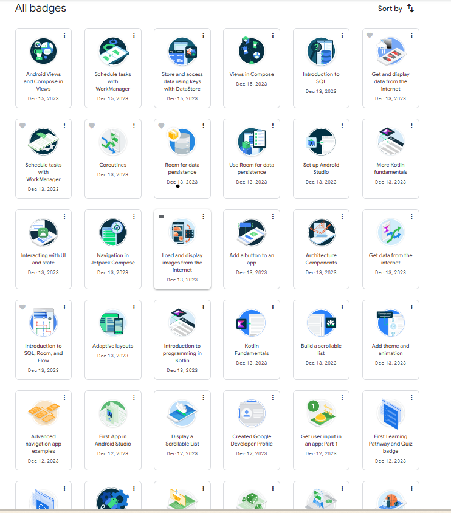

# Gambar Aplikasi Flutter Jika di "run"

# Cara Menjalankan Repository

1). Jalan kan "git clone https://github.com/07latifah/211402032_Latifah-putri-simanjuntak_UAS-pm.git" untuk mengclone direktori ke lokal

2). Masuk kedalam Code Editor (Visual Studio Code, dll)

3). Run "flutter pub get"

4). Jalankan Emulator

5). Jalankan "flutter run" untuk menjalankan aplikasi Flutter di emulator.

# Badge Developer Android

